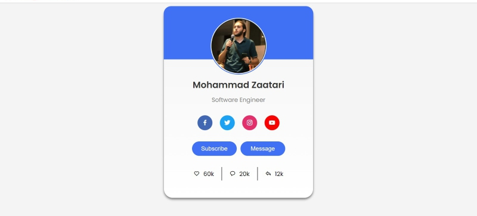

# Responsive Profile Card Project

Created a visually appealing and responsive Profile Card with HTML and CSS. Follow the step-by-step guide to build your own Profile Card UI from scratch.

## ✅ Project Highlights

- **Card Design**
  - Craft an elegant and modern Profile Card using HTML and CSS.

- **CSS Design**
  - Engage in a comprehensive HTML & CSS project, enhancing your web development skills.

## ⌚ Project Sections

Explore the key sections of this project:

1. **Profile Card Demo**
   - Witness the final Profile Card in action.

2. **File Structure**
   - Understand the organization of files for a clean project structure.

3. **Importing Google Fonts**
   - Learn how to incorporate custom fonts for a unique design.

4. **Importing Font Icons**
   - Integrate font icons to enhance visual elements.

5. **HTML Code for Profile Card**
   - Dive into the HTML code structure for building the Profile Card.

6. **CSS Code for Profile Card**
   - Explore the CSS styling to make the Profile Card visually appealing and responsive.

7. **Profile Card Final Demo**
   - See the final result of your Profile Card project.

## 🚀 Get Started

Whether you're a beginner or an experienced developer, this project will enhance your HTML and CSS skills. Create a standout Profile Card that can be easily customized for personal or professional use.

### #HTML_CSS #Profile_Card #Card_Design

